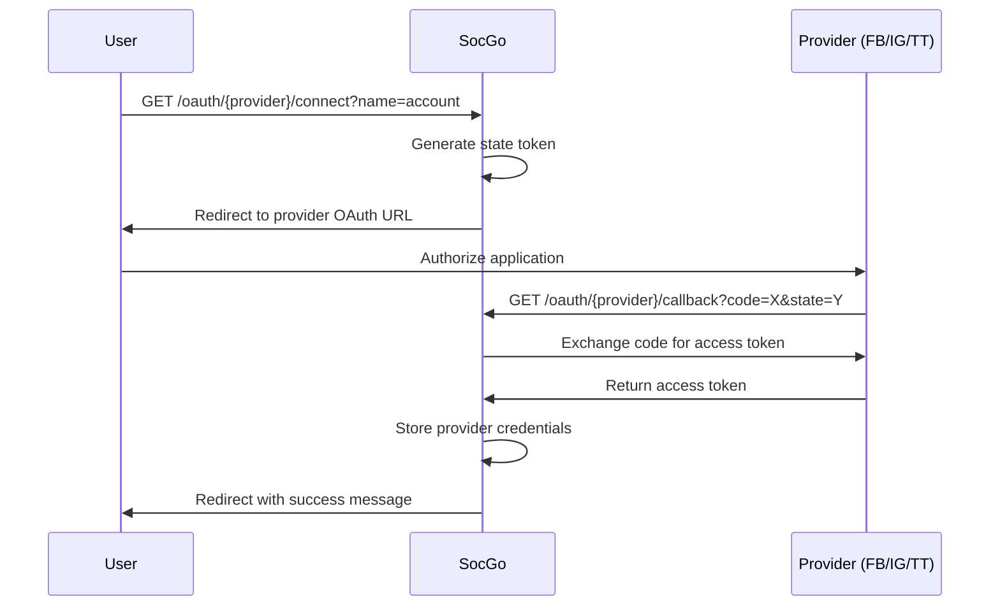

# OAuth Endpoints

Endpointy do zarządzania połączeniami OAuth z dostawcami mediów społecznościowych.

## Connect Provider

Inicjuje proces OAuth dla dostawcy.

```http
GET /oauth/{provider}/connect?name={provider_name}
```

### Parametry

| Parametr | Typ | Wymagane | Opis |
|----------|-----|----------|------|
| `provider` | string | Tak | Typ dostawcy: `facebook`, `instagram`, `tiktok` |
| `name` | string | Tak | Nazwa dostawcy (query parameter) |

### Przykład żądania

```http
GET /oauth/instagram/connect?name=my_instagram_account
```

### Odpowiedź

Przekierowanie do URL autoryzacji dostawcy.

```http
HTTP/1.1 307 Temporary Redirect
Location: https://api.instagram.com/oauth/authorize?client_id=...
```

## OAuth Callback

Obsługuje callback z dostawcy OAuth.

```http
GET /oauth/{provider}/callback
```

### Parametry query

| Parametr | Typ | Wymagane | Opis |
|----------|-----|----------|------|
| `code` | string | Tak | Kod autoryzacji od dostawcy |
| `state` | string | Tak | Token stanu (userID:providerName) |

### Przykład żądania

```http
GET /oauth/instagram/callback?code=ABC123&state=default_user:my_instagram
```

### Odpowiedź sukces

```http
HTTP/1.1 307 Temporary Redirect
Location: /?flash=Successfully%20connected%20to%20my_instagram%20(instagram)&flash_type=success
```

### Odpowiedź błąd

```http
HTTP/1.1 307 Temporary Redirect
Location: /?flash=Failed%20to%20connect%20provider&flash_type=error
```

## Obsługiwane dostawcy

### Facebook
- **Typ**: `facebook`
- **Scopes**: `pages_manage_posts`, `pages_read_engagement`
- **API Version**: v18.0

### Instagram
- **Typ**: `instagram`  
- **Scopes**: `instagram_basic`, `instagram_content_publish`
- **API Version**: v18.0

### TikTok
- **Typ**: `tiktok`
- **Scopes**: `video.list`, `video.upload`
- **API Version**: v2

## Kod błędów OAuth

| Błąd | Opis |
|------|------|
| `unsupported_provider` | Nieobsługiwany dostawca |
| `invalid_state` | Nieprawidłowy parametr state |
| `authorization_code_missing` | Brak kodu autoryzacji |
| `provider_name_required` | Wymagana nazwa dostawcy |
| `user_not_authenticated` | Użytkownik nieuwierzytelniony |

## Diagram przepływu OAuth

