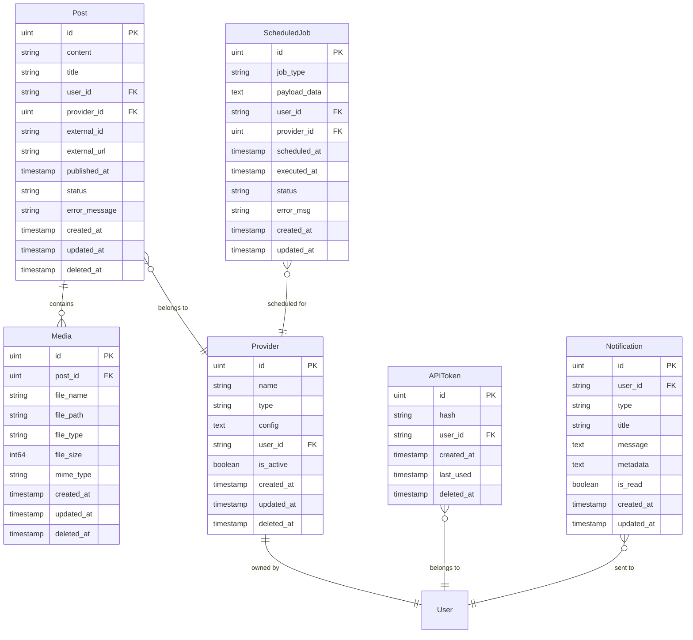

# Database Design

SocGo używa SQLite z ORM GORM do zarządzania danymi. Baza danych jest zaprojektowana z myślą o elastyczności i skalowalności.

## Schema Overview



## Tabele

### Posts
Przechowuje informacje o postach - zarówno opublikowanych jak i w trakcie przetwarzania.

```go
type Post struct {
    ID           uint           `gorm:"primaryKey"`
    Content      string         `gorm:"not null"`
    Title        string
    UserID       string         `gorm:"not null;index"`
    ProviderID   uint           `gorm:"index"`
    Provider     Provider       `gorm:"foreignKey:ProviderID"`
    ExternalID   string         `gorm:"index"`        // ID na platformie
    ExternalURL  string                              // URL do posta
    PublishedAt  *time.Time                          // Data publikacji
    Status       string         `gorm:"default:'pending'"`
    ErrorMessage string                              // Błąd publikacji
    Media        []Media        `gorm:"foreignKey:PostID"`
    CreatedAt    time.Time
    UpdatedAt    time.Time
    DeletedAt    gorm.DeletedAt `gorm:"index"`
}
```

**Statusy postów:**
- `pending` - Oczekuje na publikację
- `published` - Opublikowany pomyślnie  
- `failed` - Publikacja nieudana

### Media
Przechowuje informacje o plikach multimedialnych przypisanych do postów.

```go
type Media struct {
    ID        uint           `gorm:"primaryKey"`
    PostID    uint           `gorm:"index"`
    FileName  string         `gorm:"not null"`
    FilePath  string         `gorm:"not null"`
    FileType  string         `gorm:"not null"` // image/video
    FileSize  int64
    MimeType  string
    CreatedAt time.Time
    UpdatedAt time.Time
    DeletedAt gorm.DeletedAt `gorm:"index"`
}
```

### Providers
Konfiguracja dostawców mediów społecznościowych dla każdego użytkownika.

```go
type Provider struct {
    ID        uint           `gorm:"primaryKey"`
    Name      string         `gorm:"not null"`        // Nazwa użytkownika
    Type      string         `gorm:"not null"`        // facebook/instagram/tiktok
    Config    string         `gorm:"type:text"`       // JSON z tokenami OAuth
    UserID    string         `gorm:"not null;index"`
    IsActive  bool           `gorm:"default:true"`
    CreatedAt time.Time
    UpdatedAt time.Time
    DeletedAt gorm.DeletedAt `gorm:"index"`
}
```

**Typy dostawców:**
- `facebook` - Facebook Pages
- `instagram` - Instagram Business
- `tiktok` - TikTok for Business

### ScheduledJobs
Zadania zaplanowane do wykonania w przyszłości.

```go
type ScheduledJob struct {
    ID          uint       `gorm:"primaryKey"`
    JobType     string     `gorm:"not null"`         // Typ zadania
    PayloadData string     `gorm:"type:text"`        // Dane zadania (JSON)
    UserID      string     `gorm:"not null;index"`
    ProviderID  uint       `gorm:"index"`
    Provider    Provider   `gorm:"foreignKey:ProviderID"`
    ScheduledAt time.Time  `gorm:"not null;index"`   // Kiedy wykonać
    ExecutedAt  *time.Time                           // Kiedy wykonano
    Status      string     `gorm:"default:'pending'"`
    ErrorMsg    string                               // Błąd wykonania
    CreatedAt   time.Time
    UpdatedAt   time.Time
}
```

**Statusy zadań:**
- `pending` - Oczekuje na wykonanie
- `executing` - W trakcie wykonywania
- `completed` - Wykonane pomyślnie
- `failed` - Wykonanie nieudane

**Typy zadań:**
- `publish_post` - Publikacja posta

### APITokens
Tokeny API dla autoryzacji zewnętrznej.

```go
type APIToken struct {
    ID        uint           `gorm:"primaryKey"`
    Hash      string         `gorm:"not null;uniqueIndex;type:varchar(64)"`
    UserID    string         `gorm:"not null;index"`
    CreatedAt time.Time
    LastUsed  *time.Time
    DeletedAt gorm.DeletedAt `gorm:"index"`
}
```

### Notifications
System powiadomień dla użytkowników.

```go
type Notification struct {
    ID        uint      `gorm:"primaryKey"`
    UserID    string    `gorm:"not null;index"`
    Type      string    `gorm:"not null"`           // info/success/warning/error
    Title     string    `gorm:"not null"`
    Message   string    `gorm:"type:text"`
    Metadata  string    `gorm:"type:text"`          // JSON z dodatkowymi danymi
    IsRead    bool      `gorm:"default:false"`
    CreatedAt time.Time
    UpdatedAt time.Time
}
```

## Indeksy

Kluczowe indeksy dla wydajności:

```sql
-- Posts
CREATE INDEX idx_posts_user_id ON posts(user_id);
CREATE INDEX idx_posts_provider_id ON posts(provider_id);
CREATE INDEX idx_posts_external_id ON posts(external_id);
CREATE INDEX idx_posts_deleted_at ON posts(deleted_at);

-- Media
CREATE INDEX idx_media_post_id ON media(post_id);
CREATE INDEX idx_media_deleted_at ON media(deleted_at);

-- Providers
CREATE INDEX idx_providers_user_id ON providers(user_id);
CREATE INDEX idx_providers_deleted_at ON providers(deleted_at);

-- ScheduledJobs
CREATE INDEX idx_scheduled_jobs_user_id ON scheduled_jobs(user_id);
CREATE INDEX idx_scheduled_jobs_provider_id ON scheduled_jobs(provider_id);
CREATE INDEX idx_scheduled_jobs_scheduled_at ON scheduled_jobs(scheduled_at);

-- APITokens
CREATE UNIQUE INDEX idx_api_tokens_hash ON api_tokens(hash);
CREATE INDEX idx_api_tokens_user_id ON api_tokens(user_id);
CREATE INDEX idx_api_tokens_deleted_at ON api_tokens(deleted_at);

-- Notifications
CREATE INDEX idx_notifications_user_id ON notifications(user_id);
CREATE INDEX idx_notifications_is_read ON notifications(is_read);
```

## Migracje

Migracje są automatycznie wykonywane przy starcie aplikacji przez GORM AutoMigrate:

```go
// internal/service/database/manager.go
func (m *Manager) runMigrations(db *gorm.DB) error {
    return db.AutoMigrate(
        &data_database.Post{},
        &data_database.Media{},
        &data_database.Provider{},
        &data_database.ScheduledJob{},
        &data_database.APIToken{},
        &data_database.Notification{},
    )
}
```

### Pliki migracji SQL

Dodatkowo system obsługuje migracje SQL w katalogu `migrations/`:

- `001_initial_schema.up.sql` - Podstawowe tabele
- `002_api_tokens.up.sql` - Tabela API tokens
- `003_add_external_fields.up.sql` - Pola external_id, external_url
- `004_add_post_status_fields.up.sql` - Statusy postów
- `005_notifications.up.sql` - System powiadomień

## Backup i Recovery

### Backup SQLite
```bash
# Backup bazy danych
sqlite3 database.db ".backup backup.db"

# Lub przez kopiowanie pliku
cp database.db database_backup_$(date +%Y%m%d).db
```

### Recovery
```bash
# Przywracanie z backupu
cp database_backup_20240115.db database.db
```

## Performance Considerations

### Query Optimization
- Używanie preload dla joinów
- Paginacja dla dużych wyników
- Indeksy na często używanych polach

### Example Queries
```go
// Efficient post fetching with pagination
db.Preload("Provider").
   Where("user_id = ?", userID).
   Order("created_at DESC").
   Limit(20).Offset(offset).
   Find(&posts)

// Scheduled jobs for execution
db.Where("status = ? AND scheduled_at <= ?", "pending", time.Now()).
   Find(&jobs)
```

## Data Retention

### Soft Deletes
System używa GORM soft deletes - rekordy są oznaczane jako usunięte przez ustawienie `deleted_at`.

### Cleanup Job
Zalecane jest okresowe czyszczenie starych rekordów:

```go
// Usuwanie postów starszych niż 1 rok
db.Unscoped().Where("deleted_at < ?", time.Now().AddDate(-1, 0, 0)).
   Delete(&Post{})
```