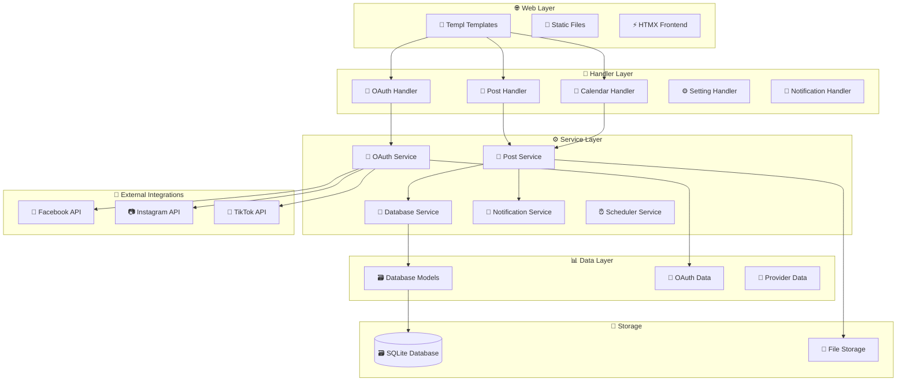
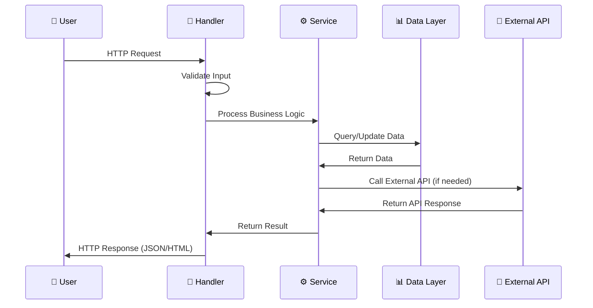
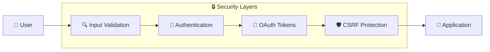

# Architecture Overview

SocGo jest zbudowany w architekturze warstwowej z wyraźnym podziałem odpowiedzialności między komponenty.

## Główne warstwy systemu



## Wzorce architektoniczne

### 1. Dependency Injection
System używa kontenera DI do zarządzania zależnościami między komponentami.

```go
// internal/service/dependency/container.go
type Container struct {
    dbManager       *database.Manager
    oauthService    *oauth.Service
    postService     *post.ProviderService
    // ...
}
```

### 2. Repository Pattern
Warstwa danych używa wzorca Repository dla abstrakcji dostępu do bazy.

### 3. Service Layer Pattern
Logika biznesowa jest enkapsulowana w serwisach.

### 4. MVC Pattern
- **Model**: Struktury danych w `internal/data/`
- **View**: Templ templates w `web/templates/`
- **Controller**: HTTP handlers w `internal/handlers/`

## Struktura katalogów

```
socgo/
├── internal/                    # Kod źródłowy aplikacji
│   ├── data/                   # Warstwa danych
│   │   ├── config/            # Konfiguracja
│   │   ├── database/          # Modele bazy danych
│   │   ├── oauth/             # Struktury OAuth
│   │   └── provider/          # Definicje dostawców
│   ├── handlers/              # HTTP handlers (Controller)
│   ├── service/               # Logika biznesowa (Service)
│   │   ├── database/          # Zarządzanie bazą danych
│   │   ├── oauth/             # Serwis OAuth
│   │   ├── post/              # Serwis postów
│   │   ├── notifications/     # Serwis powiadomień
│   │   ├── scheduler/         # Scheduler zadań
│   │   └── server/            # Serwer HTTP
│   └── social/                # Integracje z platformami
│       ├── facebook/
│       ├── instagram/
│       └── tiktok/
├── web/                        # Frontend (View)
│   ├── static/                # Pliki statyczne
│   └── templates/             # Templ templates
└── uploads/                   # Przesłane pliki
```

## Przepływ danych



## Komponenty systemu

### 1. HTTP Server
- **Framework**: Gorilla Mux
- **Port**: 8080 (domyślnie)
- **Middleware**: Authentication, Compression, CORS

### 2. Database Layer
- **Database**: SQLite z GORM ORM
- **Migracje**: Automatyczne przy starcie
- **Modele**: User, Provider, Post, ScheduledJob, Notification

### 3. OAuth Integration
- **Protokół**: OAuth 2.0
- **Dostawcy**: Facebook, Instagram, TikTok
- **Storage**: Tokeny w bazie danych

### 4. Scheduler
- **Engine**: Wbudowany scheduler
- **Funkcje**: Planowanie postów, powiadomienia
- **Persistence**: SQLite

### 5. File Management
- **Storage**: System plików
- **Typy**: Obrazy, wideo
- **Ścieżka**: `uploads/` katalog

## Zabezpieczenia



### 1. Input Validation
- Walidacja wszystkich danych wejściowych
- Sanityzacja HTML/XSS
- Sprawdzanie typów plików

### 2. Authentication
- System sesji oparty na userID
- Domyślny użytkownik: `default_user`

### 3. OAuth Security
- Bezpieczne przechowywanie tokenów
- Token refresh automatyczny
- State parameter validation

### 4. File Security
- Walidacja typu plików
- Ograniczenia rozmiaru
- Bezpieczne nazwy plików (UUID)

## Skalowalność

### Obecne ograniczenia
- SQLite (single-file database)
- Synchroniczny scheduler
- File storage w systemie plików

### Możliwe ulepszenia
- PostgreSQL/MySQL dla większej skali
- Redis dla cache i sesji
- S3/MinIO dla file storage
- Async job processing (RabbitMQ/Kafka)

## Monitoring i Debugging

### Logowanie
```go
log.Printf("Error message: %v", err)
```

### Health Checks
- Database connectivity
- External API availability
- File system access

### Metryki
- Request count/duration
- Database query performance
- External API response times