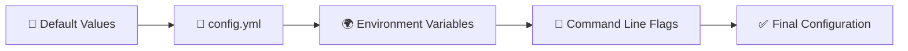

# Configuration Guide

Kompleksowy przewodnik konfiguracji SocGo - od podstawowych ustawień po zaawansowane opcje deployment.

## 📁 Pliki konfiguracyjne

### Hierarchia konfiguracji

SocGo ładuje konfigurację w następującej kolejności:

1. **Domyślne wartości** (wbudowane w kod)
2. **Plik konfiguracyjny** (`config.yml`)
3. **Zmienne środowiskowe** (prefix `SOCGO_`)
4. **Flagi command line** (jeśli dostępne)



### Lokalizacja plików

```bash
# Domyślne lokalizacje (w kolejności sprawdzania)
./config.yml                    # Katalog roboczy
./config/config.yml            # Podkatalog config
/etc/socgo/config.yml          # System-wide config
~/.config/socgo/config.yml     # User config
```

### Przykładowa konfiguracja

```yaml
# config.yml - Complete configuration example
server:
  port: 8080
  host: "localhost"
  read_timeout: 30s
  write_timeout: 30s
  idle_timeout: 120s
  max_header_bytes: 1048576

database:
  type: "sqlite"              # sqlite, postgres, mysql
  path: "database.db"         # For SQLite
  host: "localhost"           # For PostgreSQL/MySQL
  port: 5432                  # Database port
  database: "socgo"           # Database name
  username: "socgo"           # Database user
  password: ""                # Database password
  max_open_conns: 25          # Max open connections
  max_idle_conns: 5           # Max idle connections
  conn_max_lifetime: 300s     # Connection max lifetime

oauth:
  facebook:
    client_id: "your_facebook_app_id"
    client_secret: "your_facebook_app_secret"
    redirect_url: "http://localhost:8080/oauth/facebook/callback"
    scopes: ["pages_manage_posts", "pages_read_engagement"]
    api_version: "v18.0"
  
  instagram:
    client_id: "your_instagram_app_id"
    client_secret: "your_instagram_app_secret"
    redirect_url: "http://localhost:8080/oauth/instagram/callback"
    scopes: ["instagram_basic", "instagram_content_publish"]
    api_version: "v18.0"
  
  tiktok:
    client_id: "your_tiktok_client_key"
    client_secret: "your_tiktok_client_secret"
    redirect_url: "http://localhost:8080/oauth/tiktok/callback"
    scopes: ["user.info.basic", "video.upload"]
    api_version: "v2"

uploads:
  path: "./uploads"             # Upload directory
  max_size: 10485760           # Max file size in bytes (10MB)
  allowed_types:               # Allowed MIME types
    - "image/jpeg"
    - "image/png"
    - "image/gif"
    - "video/mp4"
    - "video/quicktime"
  cleanup_interval: 24h        # Cleanup old files interval

logging:
  level: "info"                # debug, info, warn, error
  format: "text"               # text, json
  output: "stdout"             # stdout, stderr, file
  file: "logs/socgo.log"       # Log file path (if output=file)
  max_size: 100MB              # Max log file size
  max_backups: 5               # Max number of old log files
  max_age: 30                  # Max age of log files in days

scheduler:
  enabled: true                # Enable job scheduler
  interval: 60s                # Check interval for jobs
  max_workers: 10              # Max concurrent workers

notifications:
  enabled: true                # Enable notification system
  cleanup_after: 168h         # Clean old notifications after (7 days)

security:
  csrf_token_length: 32        # CSRF token length
  session_timeout: 24h         # Session timeout
  rate_limit:
    enabled: true              # Enable rate limiting
    requests_per_minute: 60    # Max requests per minute per IP
    burst: 10                  # Burst allowance

monitoring:
  metrics:
    enabled: false             # Enable Prometheus metrics
    port: 9090                # Metrics server port
    path: "/metrics"          # Metrics endpoint path
  
  health_check:
    enabled: true              # Enable health check endpoint
    path: "/health"           # Health check path
  
  tracing:
    enabled: false             # Enable distributed tracing
    jaeger_endpoint: ""        # Jaeger collector endpoint

development:
  hot_reload: false            # Hot reload templates in development
  debug_templates: false       # Debug template rendering
  mock_oauth: false           # Mock OAuth for testing
```

## 🌍 Environment Variables

### Automatyczne mapowanie

SocGo automatycznie mapuje zmienne środowiskowe z prefiksem `SOCGO_`:

```bash
# Format: SOCGO_SECTION_SUBSECTION_KEY
export SOCGO_SERVER_PORT=8080
export SOCGO_DATABASE_TYPE=postgres
export SOCGO_OAUTH_FACEBOOK_CLIENT_ID=your_app_id
export SOCGO_LOGGING_LEVEL=debug
```

### Mapping Rules

```go
// Przykłady mapowania
SOCGO_SERVER_PORT           -> server.port
SOCGO_DATABASE_HOST         -> database.host
SOCGO_OAUTH_FACEBOOK_CLIENT_ID -> oauth.facebook.client_id
SOCGO_UPLOADS_MAX_SIZE      -> uploads.max_size
```

### Secrets Management

```bash
# Rekomendowane dla production - używaj secrets
export SOCGO_DATABASE_PASSWORD_FILE=/run/secrets/db_password
export SOCGO_OAUTH_FACEBOOK_CLIENT_SECRET_FILE=/run/secrets/fb_secret

# Lub bezpośrednio (mniej bezpieczne)
export SOCGO_DATABASE_PASSWORD=your_password
export SOCGO_OAUTH_FACEBOOK_CLIENT_SECRET=your_secret
```

## 🔧 Konfiguracja środowisk

### Development Environment

```yaml
# config.dev.yml
server:
  port: 8080
  host: "localhost"

database:
  type: "sqlite"
  path: "dev.db"

logging:
  level: "debug"
  format: "text"

development:
  hot_reload: true
  debug_templates: true
  mock_oauth: true

oauth:
  facebook:
    client_id: "dev_facebook_app_id"
    client_secret: "dev_facebook_secret"
    redirect_url: "http://localhost:8080/oauth/facebook/callback"
```

### Testing Environment

```yaml
# config.test.yml
server:
  port: 0  # Random available port

database:
  type: "sqlite"
  path: ":memory:"  # In-memory database

logging:
  level: "warn"
  output: "stderr"

development:
  mock_oauth: true

scheduler:
  enabled: false  # Disable scheduler in tests

notifications:
  enabled: false  # Disable notifications in tests
```

### Production Environment

```yaml
# config.prod.yml
server:
  port: 8080
  host: "0.0.0.0"
  read_timeout: 30s
  write_timeout: 30s

database:
  type: "postgres"
  host: "${DATABASE_HOST}"
  port: 5432
  database: "${DATABASE_NAME}"
  username: "${DATABASE_USERNAME}"
  password: "${DATABASE_PASSWORD}"
  max_open_conns: 25
  max_idle_conns: 5

logging:
  level: "info"
  format: "json"
  output: "stdout"

security:
  rate_limit:
    enabled: true
    requests_per_minute: 60

monitoring:
  metrics:
    enabled: true
    port: 9090
  health_check:
    enabled: true

oauth:
  facebook:
    client_id: "${FACEBOOK_CLIENT_ID}"
    client_secret: "${FACEBOOK_CLIENT_SECRET}"
    redirect_url: "https://${DOMAIN}/oauth/facebook/callback"
```

## 📊 Konfiguracja bazy danych

### SQLite (Development/Small scale)

```yaml
database:
  type: "sqlite"
  path: "socgo.db"
  
  # SQLite-specific options
  options:
    busy_timeout: 30s
    journal_mode: "WAL"
    synchronous: "NORMAL"
    cache_size: 10000
    temp_store: "MEMORY"
```

### PostgreSQL (Production)

```yaml
database:
  type: "postgres"
  host: "postgres.example.com"
  port: 5432
  database: "socgo"
  username: "socgo"
  password: "${DATABASE_PASSWORD}"
  
  # Connection pool settings
  max_open_conns: 25
  max_idle_conns: 5
  conn_max_lifetime: 300s
  
  # PostgreSQL-specific options
  options:
    sslmode: "require"
    connect_timeout: 30
    statement_timeout: 60000
    search_path: "public"
```

### MySQL (Alternative)

```yaml
database:
  type: "mysql"
  host: "mysql.example.com"
  port: 3306
  database: "socgo"
  username: "socgo"
  password: "${DATABASE_PASSWORD}"
  
  # MySQL-specific options
  options:
    charset: "utf8mb4"
    collation: "utf8mb4_unicode_ci"
    timeout: "30s"
    read_timeout: "30s"
    write_timeout: "30s"
```

## 🔐 OAuth Configuration

### Facebook/Instagram Setup

```yaml
oauth:
  facebook:
    client_id: "${FACEBOOK_CLIENT_ID}"
    client_secret: "${FACEBOOK_CLIENT_SECRET}"
    redirect_url: "https://yourdomain.com/oauth/facebook/callback"
    scopes:
      - "pages_manage_posts"
      - "pages_read_engagement"
      - "pages_show_list"
    api_version: "v18.0"
    
    # Advanced settings
    timeout: 30s
    retry_attempts: 3
    rate_limit: 200  # calls per hour
    
  instagram:
    client_id: "${INSTAGRAM_CLIENT_ID}"
    client_secret: "${INSTAGRAM_CLIENT_SECRET}"
    redirect_url: "https://yourdomain.com/oauth/instagram/callback"
    scopes:
      - "instagram_basic"
      - "instagram_content_publish"
    api_version: "v18.0"
    
    # Instagram-specific settings
    image_quality: 95
    max_image_size: 8388608  # 8MB
```

### TikTok Setup

```yaml
oauth:
  tiktok:
    client_id: "${TIKTOK_CLIENT_KEY}"
    client_secret: "${TIKTOK_CLIENT_SECRET}"
    redirect_url: "https://yourdomain.com/oauth/tiktok/callback"
    scopes:
      - "user.info.basic"
      - "video.upload"
      - "video.list"
    api_version: "v2"
    
    # TikTok-specific settings
    video_quality: "high"
    max_video_size: 524288000  # 500MB
    chunk_size: 10485760      # 10MB chunks
```

## 📂 File Management

### Upload Configuration

```yaml
uploads:
  path: "./uploads"
  max_size: 10485760  # 10MB default
  
  # File type restrictions
  allowed_types:
    - "image/jpeg"
    - "image/png"
    - "image/gif"
    - "image/webp"
    - "video/mp4"
    - "video/quicktime"
    - "video/webm"
  
  # Image processing
  image:
    max_width: 1920
    max_height: 1920
    quality: 95
    auto_orient: true
    strip_metadata: true
  
  # Video processing
  video:
    max_duration: 600  # 10 minutes
    max_bitrate: 5000  # 5 Mbps
    auto_compress: true
  
  # Cleanup settings
  cleanup:
    enabled: true
    interval: 24h
    max_age: 168h  # 7 days
    orphaned_files: true
```

### Storage Backends

```yaml
storage:
  backend: "local"  # local, s3, gcs, azure
  
  # Local storage
  local:
    path: "./uploads"
    permissions: 0755
  
  # AWS S3
  s3:
    bucket: "socgo-uploads"
    region: "us-east-1"
    access_key: "${AWS_ACCESS_KEY_ID}"
    secret_key: "${AWS_SECRET_ACCESS_KEY}"
    endpoint: ""  # Custom endpoint for S3-compatible services
  
  # Google Cloud Storage
  gcs:
    bucket: "socgo-uploads"
    project_id: "your-project-id"
    credentials_file: "/path/to/credentials.json"
  
  # Azure Blob Storage
  azure:
    account_name: "${AZURE_ACCOUNT_NAME}"
    account_key: "${AZURE_ACCOUNT_KEY}"
    container: "socgo-uploads"
```

## 📝 Logging Configuration

### Log Levels and Formats

```yaml
logging:
  level: "info"  # trace, debug, info, warn, error, fatal, panic
  format: "json"  # text, json
  
  # Output destinations
  output: "stdout"  # stdout, stderr, file, syslog
  
  # File output settings
  file:
    path: "logs/socgo.log"
    max_size: 100MB
    max_backups: 10
    max_age: 30  # days
    compress: true
  
  # Syslog settings
  syslog:
    network: "udp"
    address: "localhost:514"
    tag: "socgo"
    facility: "local0"
  
  # Component-specific logging
  components:
    oauth: "debug"
    database: "warn"
    providers: "info"
    scheduler: "info"
```

### Structured Logging

```yaml
logging:
  format: "json"
  
  # Additional fields
  fields:
    service: "socgo"
    version: "${APP_VERSION}"
    environment: "${ENVIRONMENT}"
    instance_id: "${INSTANCE_ID}"
  
  # Sensitive field filtering
  sensitive_fields:
    - "password"
    - "token"
    - "secret"
    - "key"
```

## 🔒 Security Configuration

### Authentication & Authorization

```yaml
security:
  # Session management
  session:
    timeout: 24h
    cookie_name: "socgo_session"
    cookie_secure: true
    cookie_http_only: true
    cookie_same_site: "strict"
  
  # CSRF protection
  csrf:
    enabled: true
    token_length: 32
    cookie_name: "socgo_csrf"
    header_name: "X-CSRF-Token"
  
  # Rate limiting
  rate_limit:
    enabled: true
    requests_per_minute: 60
    burst: 10
    
    # Different limits per endpoint
    endpoints:
      "/oauth/*": 10
      "/posts": 30
      "/api/*": 100
  
  # Content Security Policy
  csp:
    enabled: true
    policy: "default-src 'self'; script-src 'self' 'unsafe-inline'; style-src 'self' 'unsafe-inline'"
  
  # Security headers
  headers:
    x_frame_options: "DENY"
    x_content_type_options: "nosniff"
    x_xss_protection: "1; mode=block"
    strict_transport_security: "max-age=31536000; includeSubDomains"
```

### TLS/SSL Configuration

```yaml
security:
  tls:
    enabled: true
    cert_file: "/etc/certs/server.crt"
    key_file: "/etc/certs/server.key"
    
    # TLS settings
    min_version: "1.2"
    cipher_suites:
      - "TLS_ECDHE_RSA_WITH_AES_256_GCM_SHA384"
      - "TLS_ECDHE_RSA_WITH_CHACHA20_POLY1305"
      - "TLS_ECDHE_RSA_WITH_AES_128_GCM_SHA256"
    
    # ACME/Let's Encrypt
    acme:
      enabled: false
      directory: "https://acme-v02.api.letsencrypt.org/directory"
      email: "admin@yourdomain.com"
      domains:
        - "socgo.yourdomain.com"
```

## 📊 Monitoring & Observability

### Metrics Configuration

```yaml
monitoring:
  metrics:
    enabled: true
    port: 9090
    path: "/metrics"
    
    # Prometheus settings
    prometheus:
      namespace: "socgo"
      subsystem: ""
      
      # Custom metrics
      custom_metrics:
        - name: "posts_published_total"
          type: "counter"
          help: "Total number of posts published"
          labels: ["provider", "user_id"]
  
  # Health checks
  health:
    enabled: true
    path: "/health"
    
    # Component health checks
    checks:
      database: true
      oauth_providers: true
      file_storage: true
      external_apis: true
  
  # Distributed tracing
  tracing:
    enabled: false
    service_name: "socgo"
    
    # Jaeger settings
    jaeger:
      endpoint: "http://jaeger-collector:14268/api/traces"
      sampler_type: "const"
      sampler_param: 1
    
    # OTLP settings
    otlp:
      endpoint: "http://otel-collector:4317"
      insecure: true
```

### Performance Monitoring

```yaml
performance:
  # Request timeout settings
  timeouts:
    read: 30s
    write: 30s
    idle: 120s
    shutdown: 30s
  
  # Circuit breaker
  circuit_breaker:
    enabled: true
    failure_threshold: 5
    recovery_timeout: 60s
    request_timeout: 30s
  
  # Connection pooling
  pools:
    database:
      max_open: 25
      max_idle: 5
      max_lifetime: 300s
    
    http_client:
      max_idle_conns: 100
      max_idle_conns_per_host: 10
      idle_conn_timeout: 90s
```

## 🔧 Advanced Configuration

### Feature Flags

```yaml
features:
  # Provider features
  providers:
    facebook: true
    instagram: true
    tiktok: true
    linkedin: false  # Future provider
  
  # Application features
  bulk_publishing: false
  analytics: false
  webhooks: false
  api_v2: false
  
  # Experimental features
  experimental:
    ai_content_suggestions: false
    auto_scheduling: false
    content_templates: false
```

### Scheduler Configuration

```yaml
scheduler:
  enabled: true
  
  # Worker settings
  workers:
    count: 10
    queue_size: 1000
    
  # Job settings
  jobs:
    max_retries: 3
    retry_delay: 60s
    cleanup_after: 168h  # 7 days
    
  # Job types
  types:
    publish_post:
      enabled: true
      timeout: 300s
      max_concurrent: 5
    
    cleanup_files:
      enabled: true
      timeout: 60s
      schedule: "0 2 * * *"  # Daily at 2 AM
    
    refresh_tokens:
      enabled: true
      timeout: 30s
      schedule: "0 */6 * * *"  # Every 6 hours
```

### Multi-tenant Configuration

```yaml
# Multi-tenant support (future feature)
tenancy:
  enabled: false
  mode: "single"  # single, multi
  
  # Database per tenant
  database_per_tenant: false
  
  # Tenant isolation
  isolation:
    data: true
    uploads: true
    oauth: true
    
  # Default tenant settings
  defaults:
    max_providers: 10
    max_posts_per_day: 100
    storage_quota: 1073741824  # 1GB
```

To bardzo kompleksowy przewodnik konfiguracji pokrywający wszystkie aspekty SocGo! ⚙️