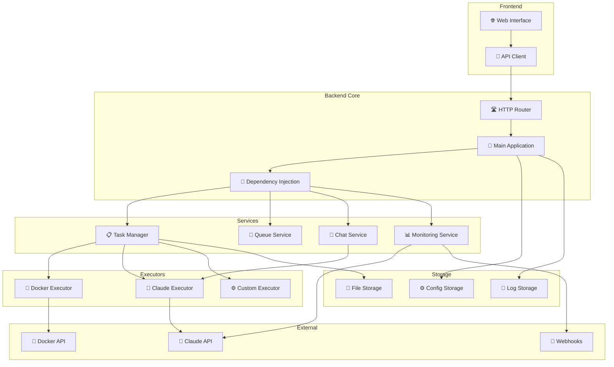
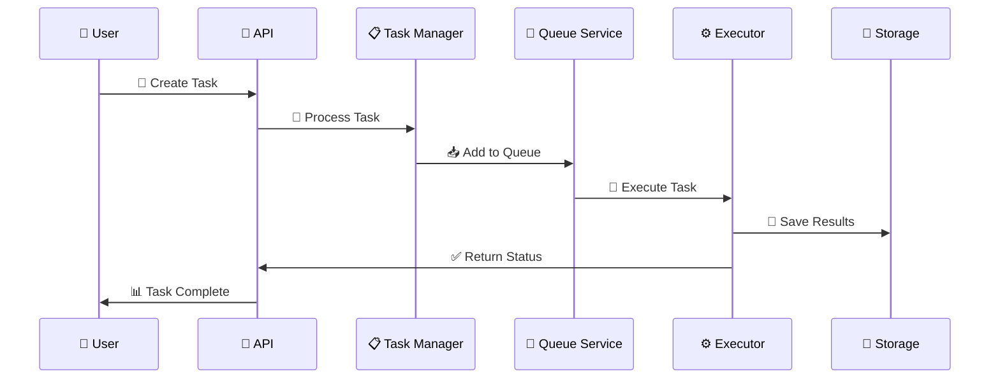
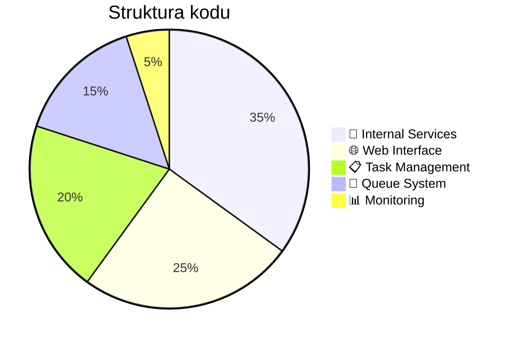

# Code Generation Manager

Zaawansowany system zarządzania generowaniem kodu z AI napisany w Go.

## 🎯 Dlaczego Code Generation Manager?

Code Generation Manager to zaawansowany system, który umożliwia:

- **🚀 Automatyzację** procesów generowania kodu
- **📊 Monitorowanie** kosztów i użycia AI
- **⚙️ Zarządzanie** zadaniami i kolejkami
- **🔗 Integrację** z różnymi executorami
- **🛡️ Bezpieczeństwo** i kontrolę dostępu

## 🏗️ Architektura systemu



## 🔄 Przepływ danych



## 🚀 Szybki start

```bash
# 📥 Klonuj repozytorium
git clone https://github.com/your-username/code-gen-manager.git
cd code-gen-manager

# ⚙️ Skopiuj konfigurację
cp config.example.yml config.yml

# 🚀 Uruchom aplikację
go run main.go
```

## 📖 Dokumentacja

### 🏗️ Architektura i design
- **[🏗️ Przegląd architektury](./architecture/)** - Struktura systemu i wzorce projektowe
- **[🔧 Dependency Injection](./architecture/overview.md)** - Zarządzanie zależnościami

### 🔌 API i integracje
- **[🔌 API Reference](./api/)** - Pełna dokumentacja REST API
- **[📋 Endpointy](./api/endpoints.md)** - Lista wszystkich endpointów

### ⚙️ Konfiguracja i deployment
- **[⚙️ Konfiguracja](./configuration/)** - Ustawienia systemu
- **[📄 Plik konfiguracyjny](./configuration/config-file.md)** - Opis pliku `config.yml`
- **[🚀 Deployment](./deployment/)** - Wdrażanie systemu
- **[📦 Instalacja](./deployment/installation.md)** - Instrukcje instalacji

### 🛠️ Development i contributing
- **[🛠️ Development](./development/)** - Rozwój systemu
- **[🏗️ Struktura kodu](./development/code-structure.md)** - Organizacja kodu
- **[🧪 Testy](./development/testing.md)** - Pisanie i uruchamianie testów
- **[🤝 Contributing](./development/contributing.md)** - Jak współtworzyć projekt

### 🎯 Funkcjonalności
- **[🎯 Funkcjonalności](./features/)** - Przegląd wszystkich funkcji
- **[📋 Zarządzanie zadaniami](./features/task-management/)** - Tworzenie i zarządzanie zadaniami
- **[🔄 System kolejek](./features/queue-system/)** - Kolejkowanie i przetwarzanie
- **[💬 Chat z AI](./features/chat-system/)** - Interaktywny chat
- **[📊 Monitorowanie Claude](./features/claude-monitoring/)** - Statystyki użycia
- **[🔍 Monitorowanie wzorców](./features/pattern-monitoring/)** - Analiza wzorców

## 🛠️ Technologie

| Kategoria | Technologia | Opis |
|-----------|-------------|------|
| **🔧 Backend** | Go (Golang) | Główny język aplikacji |
| **🌐 Frontend** | Vue.js + Templ | Interfejs użytkownika |
| **🤖 AI** | Claude API, GPT | Modele AI |
| **🐳 Containerization** | Docker | Izolacja środowisk |
| **💾 Database** | File-based storage | Przechowywanie danych |
| **📚 Documentation** | VitePress | Dokumentacja techniczna |

## 📊 Statystyki projektu



## 🤝 Contributing

Zapraszamy do współpracy! Sprawdź **[🤝 Contributing Guide](./development/contributing.md)** aby dowiedzieć się więcej.

