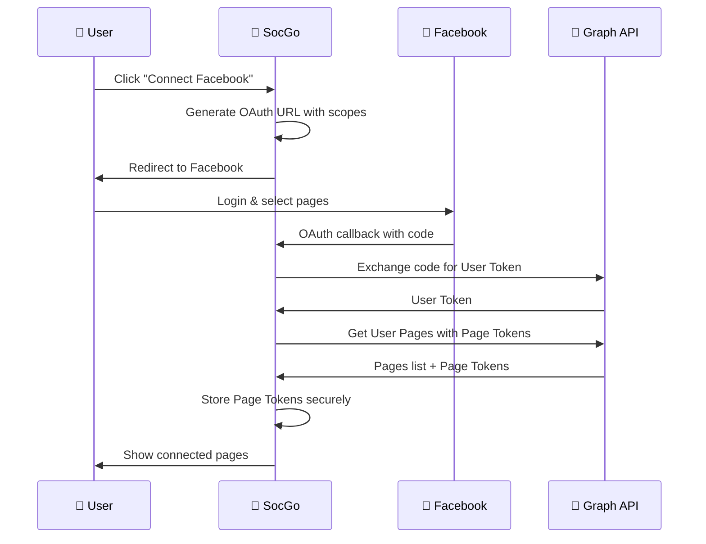
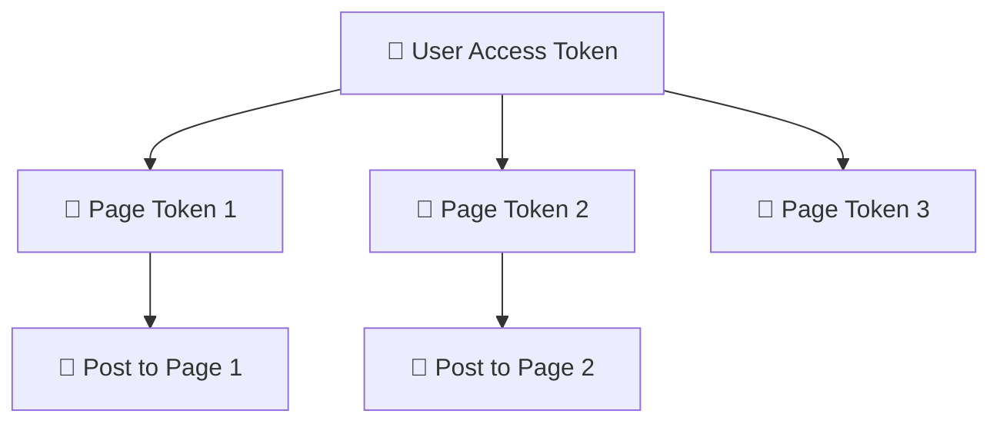

# Facebook Integration

Szczegółowy przewodnik integracji SocGo z Facebook Pages API dla publikowania postów i zarządzania treściami.

## 📋 Wymagania

### Facebook App
- **Facebook for Developers Account**
- **Aplikacja Facebook** z Facebook Login
- **Uprawnienia**: `pages_manage_posts`, `pages_read_engagement`
- **Typ aplikacji**: Business (dla production)

### Ograniczenia API
- **Rate Limit**: 200 calls/hour na User Token
- **Content Limit**: 63,206 znaków na post
- **Image Limit**: 100MB na obraz
- **Supported Formats**: JPG, PNG, GIF

## ⚙️ Konfiguracja

### 1. Facebook Developer Console

1. **Utwórz aplikację**:
   ```
   https://developers.facebook.com/apps/
   ```

2. **Dodaj Facebook Login**:
   - Products → Add Product → Facebook Login
   - Valid OAuth Redirect URIs: `http://localhost:8080/oauth/facebook/callback`

3. **Konfiguruj uprawnienia**:
   ```
   pages_manage_posts    - Publikowanie na stronach
   pages_read_engagement - Odczyt statistyk
   pages_show_list      - Lista stron użytkownika
   ```

### 2. SocGo Configuration

W `config.yml`:

```yaml
oauth:
  facebook:
    client_id: "your_facebook_app_id"
    client_secret: "your_facebook_app_secret"
    redirect_url: "http://localhost:8080/oauth/facebook/callback"
    scopes: 
      - "pages_manage_posts"
      - "pages_read_engagement"
      - "pages_show_list"
    api_version: "v18.0"
    
    # Opcjonalne ustawienia
    timeout: 30s
    retry_attempts: 3
    rate_limit: 200  # calls per hour
```

## 🔗 Proces połączenia

### Przepływ OAuth



### Kroki użytkownika

1. **Settings** → **Providers** → **Facebook**
2. Kliknij **"Connect"**
3. Zaloguj się na Facebook
4. **Wybierz strony** do zarządzania
5. **Autoryzuj uprawnienia**
6. Wróć do SocGo - strony będą widoczne

## 📝 Publikowanie postów

### Obsługiwane typy treści

#### Posty tekstowe
```json
{
  "provider_id": 1,
  "content": "Hello Facebook! 👋\n\nThis is a test post from SocGo.",
  "schedule_at": "now"
}
```

#### Posty z obrazami
```json
{
  "provider_id": 1,
  "content": "Check out this amazing photo!",
  "files": [
    {
      "type": "image",
      "url": "/uploads/image.jpg"
    }
  ]
}
```

### API Mapping

SocGo automatycznie mapuje żądania na Facebook Graph API:

```go
// SocGo Request → Facebook API
POST /posts → POST /{page_id}/feed

// Przykładowe wywołanie Facebook API
POST https://graph.facebook.com/v18.0/{page_id}/feed
Content-Type: application/json
Authorization: Bearer {page_access_token}

{
  "message": "Post content",
  "attached_media": [
    {
      "media_fbid": "uploaded_photo_id"
    }
  ]
}
```

## 📊 Funkcje zaawansowane

### Page Token Management

Facebook używa hierarchii tokenów:



### Media Upload Process

```go
// 1. Upload image to Facebook
uploadResponse := facebook.UploadPhoto(image, pageToken)

// 2. Get media_fbid
mediaID := uploadResponse.ID

// 3. Publish post with media
post := facebook.PublishPost({
    Message: content,
    AttachedMedia: []Media{{MediaFBID: mediaID}}
})
```

### Error Handling

```go
type FacebookError struct {
    Code    int    `json:"code"`
    Message string `json:"message"`
    Type    string `json:"type"`
    Subcode int    `json:"error_subcode"`
}

// Przykłady błędów:
// Code 190: Token expired
// Code 100: Invalid parameter
// Code 613: Rate limit exceeded
```

## 🔧 Debugging

### Debug Mode

W `config.yml`:
```yaml
debug:
  facebook: true
  api_calls: true
```

### Logi przykładowe

```
2024/01/15 10:30:00 [Facebook] Getting pages for user
2024/01/15 10:30:01 [Facebook] Found 3 pages
2024/01/15 10:30:01 [Facebook] Publishing to page: My Business Page
2024/01/15 10:30:02 [Facebook] Post published: 12345678901234567
```

### Test połączenia

```bash
# Test OAuth callback
curl -X GET "http://localhost:8080/oauth/facebook/callback?code=test&state=user:page"

# Test publikacji
curl -X POST "http://localhost:8080/posts" \
  -H "Content-Type: application/json" \
  -d '{
    "provider_id": 1,
    "content": "Test post",
    "schedule_at": "now"
  }'
```

## 📈 Monitorowanie

### Metrics dostępne

- **Posts Published**: Liczba opublikowanych postów
- **API Calls**: Liczba wywołań API
- **Error Rate**: Procent błędów
- **Response Time**: Średni czas odpowiedzi

### Facebook API Limits

```yaml
# Limity na aplikację
app_level_rate_limit: 200 calls/hour

# Limity na stronę
page_level_rate_limit: 25000 calls/day

# Limity na użytkownika
user_level_rate_limit: 100 calls/hour
```

## 🚨 Troubleshooting

### Częste problemy

#### 1. Token Expired (Error 190)
```
Błąd: "Error validating access token: Session has expired"
Rozwiązanie: Reconnect Facebook provider w Settings
```

#### 2. Missing Permissions (Error 200)
```
Błąd: "Insufficient privileges to perform this action"
Rozwiązanie: Sprawdź uprawnienia strony w Facebook
```

#### 3. Rate Limit Exceeded (Error 613)
```
Błąd: "Calls to this api have exceeded the rate limit"
Rozwiązanie: Poczekaj lub upgrade Facebook App
```

#### 4. Invalid Page ID (Error 803)
```
Błąd: "Some of the aliases you requested do not exist"
Rozwiązanie: Sprawdź czy strona nadal istnieje
```

### Diagnostyka

#### Sprawdź token validity
```bash
curl -X GET \
  "https://graph.facebook.com/v18.0/me?access_token={token}"
```

#### Sprawdź page permissions
```bash
curl -X GET \
  "https://graph.facebook.com/v18.0/{page_id}?fields=access_token&access_token={user_token}"
```

#### Sprawdź rate limits
```bash
curl -I -X GET \
  "https://graph.facebook.com/v18.0/{page_id}/feed?access_token={page_token}"
```

Response headers:
```
X-App-Usage: {"call_count":1,"total_cputime":0,"total_time":1}
X-Page-Usage: {"call_count":1,"total_cputime":0,"total_time":1}
```

## 📝 Best Practices

### 1. Token Management
- **Long-lived tokens**: Użyj long-lived page tokens
- **Token refresh**: Implementuj automatyczne odnawianie
- **Secure storage**: Szyfruj tokeny w bazie danych

### 2. Content Optimization
- **Image compression**: Optymalizuj obrazy przed upload
- **Content length**: Trzymaj się limitów znaków
- **Hashtags**: Używaj maksymalnie 2-3 hashtagi

### 3. Error Recovery
- **Retry logic**: Implementuj exponential backoff
- **Graceful degradation**: Obsłuż błędy API gracefully
- **User feedback**: Informuj użytkownika o problemach

### 4. Performance
- **Batch uploads**: Grupuj upload obrazów
- **Async processing**: Używaj async dla długich operacji
- **Caching**: Cache page tokens i metadata

## 🔄 Migration & Updates

### Facebook API Versions
Facebook regularnie wydaje nowe wersje API:

```yaml
# Aktualna wersja
api_version: "v18.0"  # Expires: May 2025

# Planowana migracja
migration:
  from: "v18.0"
  to: "v19.0"
  deadline: "2025-05-01"
```

### Breaking Changes
- **Token format changes**
- **New permission requirements** 
- **Deprecated endpoints**
- **New rate limits**

### Update Process
1. **Test new API version** w development
2. **Update configuration**
3. **Re-authenticate users** jeśli potrzeba
4. **Monitor error rates** po update