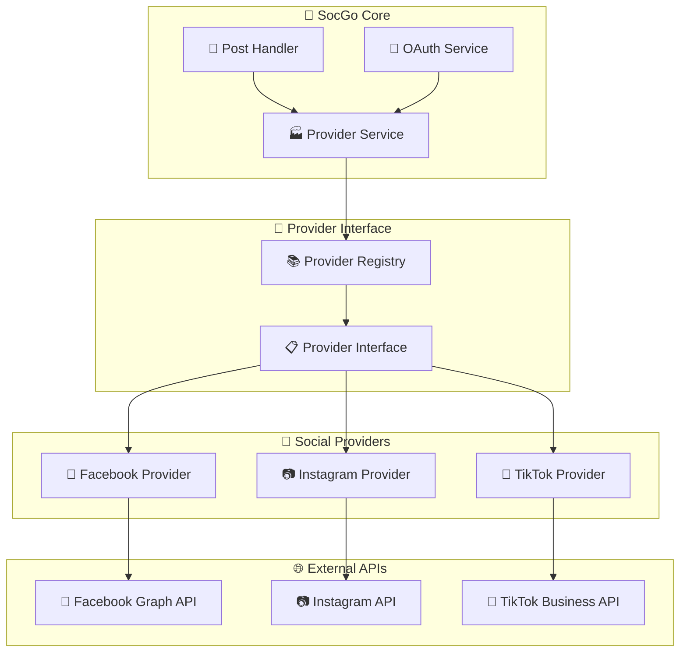
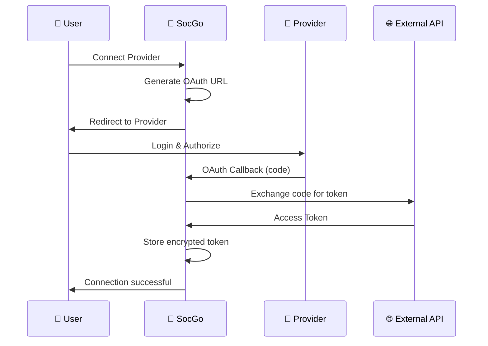

# Social Media Providers

SocGo obsługuje publikowanie treści na wielu platformach społecznościowych dzięki systemowi providerów opartemu na OAuth 2.0.

## 🌐 Obsługiwane platformy

| Platforma | Status | Funkcje | API Version |
|-----------|--------|---------|-------------|
| [Facebook](#facebook) | ✅ Pełne wsparcie | Posty, obrazy, planowanie | Graph API v18.0 |
| [Instagram](#instagram) | ✅ Pełne wsparcie | Posty, obrazy, planowanie | Graph API v18.0 |
| [TikTok](#tiktok) | ✅ Pełne wsparcie | Wideo, planowanie | TikTok API v2 |

## 🔄 Architektura providerów



## 🔧 Provider Interface

Każdy provider implementuje wspólny interfejs:

```go
type Provider interface {
    // OAuth methods
    GetAuthURL(state string) string
    ExchangeCodeForToken(code string) (*oauth.Token, error)
    RefreshToken(token *oauth.Token) (*oauth.Token, error)
    
    // Publishing methods
    PublishPost(content string, media []Media) (string, error)
    SchedulePost(content string, media []Media, publishTime time.Time) (string, error)
    
    // Validation methods
    ValidateToken(token *oauth.Token) error
    GetUserInfo(token *oauth.Token) (*UserInfo, error)
}
```

## 📊 Przepływ OAuth



## 🔒 Bezpieczeństwo

### Token Management
- **Szyfrowanie**: Tokeny są szyfrowane w bazie danych
- **Automatic Refresh**: Automatyczne odnawianie tokenów OAuth
- **Scope Validation**: Sprawdzanie uprawnień przed publikacją
- **Secure Storage**: Bezpieczne przechowywanie credentials

### Validation
```go
// Walidacja przed publikacją
func (p *FacebookProvider) ValidatePost(content string, media []Media) error {
    if len(content) > 63206 {
        return errors.New("Content too long for Facebook")
    }
    
    for _, m := range media {
        if m.Size > 100*1024*1024 { // 100MB
            return errors.New("File too large for Facebook")
        }
    }
    
    return nil
}
```

## 📈 Monitoring i Analytics

### Metrics Collection
- **Success Rate**: Procent udanych publikacji
- **Response Time**: Czas odpowiedzi API
- **Error Tracking**: Analiza błędów
- **Rate Limiting**: Monitorowanie limitów API

### Health Checks
```go
func (p *Provider) HealthCheck() error {
    // Check token validity
    if err := p.ValidateToken(); err != nil {
        return err
    }
    
    // Test API connectivity
    if err := p.TestConnection(); err != nil {
        return err
    }
    
    return nil
}
```

## 🎛️ Konfiguracja

### Global Provider Settings
```yaml
providers:
  rate_limits:
    facebook: 200  # requests per hour
    instagram: 100
    tiktok: 50
  
  timeouts:
    connection: 30s
    request: 60s
  
  retry:
    max_attempts: 3
    backoff: exponential
```

### Per-Provider Configuration
Każdy provider ma swoje specyficzne ustawienia w `config.yml`:

```yaml
oauth:
  facebook:
    client_id: "your_app_id"
    client_secret: "your_app_secret"
    redirect_url: "http://localhost:8080/oauth/facebook/callback"
    scopes: ["pages_manage_posts", "pages_read_engagement"]
    api_version: "v18.0"
```

## 🚀 Dodawanie nowego providera

### 1. Implementacja interface
```go
type NewProvider struct {
    config *ProviderConfig
    client *http.Client
}

func (p *NewProvider) PublishPost(content string, media []Media) (string, error) {
    // Implementation specific to the new provider
}
```

### 2. Rejestracja w registry
```go
func init() {
    registry.RegisterProvider("newprovider", &NewProvider{})
}
```

### 3. Dodanie konfiguracji
```yaml
oauth:
  newprovider:
    client_id: "client_id"
    client_secret: "client_secret"
    redirect_url: "http://localhost:8080/oauth/newprovider/callback"
```

## 📋 Provider Status

### Status Codes
- `active` - Provider aktywny i gotowy
- `inactive` - Provider wyłączony
- `error` - Błąd konfiguracji/połączenia
- `rate_limited` - Ograniczenie API
- `token_expired` - Token wygasł

### Status Check Endpoint
```http
GET /api/providers/status
```

Response:
```json
{
  "providers": [
    {
      "type": "facebook",
      "name": "My Business Page",
      "status": "active",
      "last_used": "2024-01-15T10:30:00Z",
      "posts_count": 25
    }
  ]
}
```

## 🔍 Troubleshooting

### Częste problemy

#### Token Expired
```
Error: OAuth token has expired
Solution: Reconnect provider in Settings
```

#### Rate Limit Exceeded
```
Error: Rate limit exceeded for Facebook API
Solution: Wait for reset or upgrade API plan
```

#### Invalid Permissions
```
Error: Missing required scope 'pages_manage_posts'
Solution: Re-authorize with correct permissions
```

### Debug Mode
Włącz dodatkowe logowanie w `config.yml`:
```yaml
debug:
  providers: true
  oauth: true
  api_calls: true
```

## 📚 Provider-specific Guides

### [Facebook Integration](./facebook.md)
Szczegółowy przewodnik integracji z Facebook Pages i Instagram Business.

### [Instagram Integration](./instagram.md)
Konfiguracja Instagram Business Account i Instagram Basic Display.

### [TikTok Integration](./tiktok.md)
Setup TikTok for Business API i publikowanie wideo.

## 🔄 Migration Guide

### From v1.0 to v2.0
Provider system został przepisany w wersji 2.0:

1. **Backup tokens**: Eksportuj tokeny przed upgradem
2. **Update config**: Nowy format konfiguracji
3. **Reconnect providers**: Konieczne ponowne połączenie
4. **Test publishing**: Sprawdź czy wszystko działa

## 🎯 Roadmap

### Planowane platformy
- **LinkedIn** - LinkedIn Company Pages
- **Twitter/X** - X API v2
- **YouTube** - YouTube Data API
- **Pinterest** - Pinterest Business API

### Nowe funkcje
- **Bulk publishing** - Publikacja wielu postów
- **Content templates** - Szablony treści
- **A/B testing** - Testowanie wariantów
- **Analytics integration** - Pobieranie statystyk