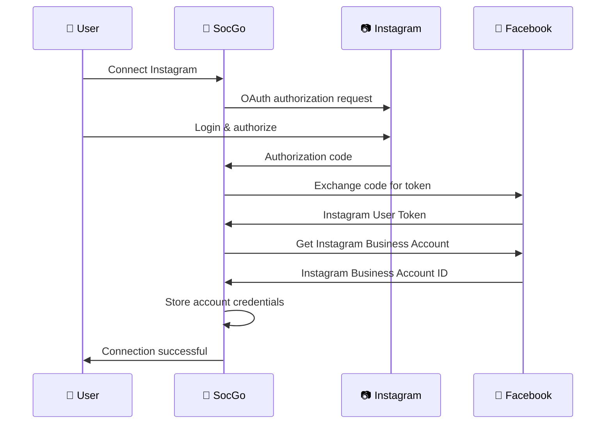
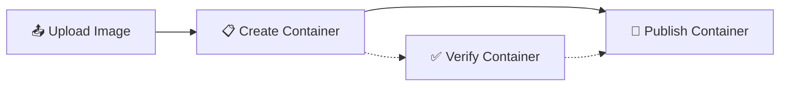

# Instagram Integration

Przewodnik integracji SocGo z Instagram Business API dla publikowania zdjęć i zarządzania treściami Instagram.

## 📋 Wymagania

### Instagram Business Account
- **Instagram Business Account** (nie Personal)
- **Facebook Page** połączona z Instagram
- **Facebook App** z Instagram Basic Display
- **Uprawnienia**: `instagram_basic`, `instagram_content_publish`

### Ograniczenia API
- **Rate Limit**: 100 calls/hour na User Token
- **Image Requirements**: JPG, PNG (maksymalnie 8MB)
- **Image Ratio**: 0.8:1 do 1.91:1 (kwadrat do panorama)
- **Content Limit**: 2,200 znaków w opisie

## ⚙️ Konfiguracja

### 1. Facebook Developer Console

1. **Dodaj Instagram Basic Display**:
   ```
   Products → Add Product → Instagram Basic Display
   ```

2. **Konfiguruj OAuth**:
   - Valid OAuth Redirect URIs: `http://localhost:8080/oauth/instagram/callback`
   - Deauthorize Callback URL: `http://localhost:8080/oauth/instagram/deauth`

3. **Instagram App Review** (dla production):
   - `instagram_content_publish` wymaga App Review
   - Przygotuj demo video i use case description

### 2. SocGo Configuration

W `config.yml`:

```yaml
oauth:
  instagram:
    client_id: "your_instagram_app_id"
    client_secret: "your_instagram_app_secret"
    redirect_url: "http://localhost:8080/oauth/instagram/callback"
    scopes:
      - "instagram_basic"
      - "instagram_content_publish"
    api_version: "v18.0"
    
    # Instagram-specific settings
    image_quality: 95
    max_image_size: 8388608  # 8MB
    supported_formats: ["jpg", "jpeg", "png"]
    aspect_ratio:
      min: 0.8   # 4:5 portrait
      max: 1.91  # 1.91:1 landscape
```

## 🔗 Proces połączenia

### Instagram OAuth Flow



### Connection Requirements

#### Sprawdzenie Account Type
```bash
# Sprawdź czy konto jest Business
curl -X GET \
  "https://graph.facebook.com/v18.0/{instagram_account_id}?fields=account_type&access_token={access_token}"

# Response dla Business Account:
{
  "account_type": "BUSINESS",
  "id": "123456789"
}
```

## 📝 Publikowanie treści

### Container-based Publishing

Instagram API używa 2-etapowego procesu:



### 1. Upload i Create Container

```go
// SocGo automatycznie:
// 1. Upload image to Instagram
// 2. Create media container
containerResp := instagram.CreateContainer({
    ImageURL: uploadedImageURL,
    Caption: postContent,
    AccessToken: businessToken
})

// Response:
{
  "id": "container_id_123"
}
```

### 2. Publish Container

```go
// Po weryfikacji publish container
publishResp := instagram.PublishContainer({
    CreationID: containerID,
    AccessToken: businessToken
})

// Response:
{
  "id": "published_media_id_456"
}
```

### Przykład żądania SocGo

```json
{
  "provider_id": 2,
  "content": "Amazing sunset 🌅 #sunset #photography #nature",
  "files": [
    {
      "type": "image",
      "url": "/uploads/sunset.jpg"
    }
  ],
  "schedule_at": "2024-01-15T18:00:00Z"
}
```

## 🖼️ Obsługa obrazów

### Wymagania obrazów

```yaml
image_requirements:
  formats: ["jpg", "jpeg", "png"]
  max_size: 8388608  # 8MB
  min_resolution: 320x320
  max_resolution: 1440x1440
  aspect_ratio:
    min: 0.8   # 4:5 (portrait)
    max: 1.91  # 1.91:1 (landscape)
```

### Automatyczna optymalizacja

SocGo automatycznie:

```go
func OptimizeInstagramImage(image []byte) ([]byte, error) {
    // 1. Sprawdź format
    if !isValidFormat(image) {
        return nil, errors.New("unsupported format")
    }
    
    // 2. Sprawdź rozmiar
    if len(image) > MaxImageSize {
        image = compressImage(image, 85) // Kompresja JPEG
    }
    
    // 3. Sprawdź aspect ratio
    if !isValidAspectRatio(image) {
        image = cropToValidRatio(image)
    }
    
    // 4. Sprawdź resolution
    if exceedsMaxResolution(image) {
        image = resizeImage(image, 1440, 1440)
    }
    
    return image, nil
}
```

## 📊 Funkcje zaawansowane

### Business Account Integration

```go
// Pobierz informacje o Business Account
type InstagramBusinessAccount struct {
    ID          string `json:"id"`
    Username    string `json:"username"`
    AccountType string `json:"account_type"`
    MediaCount  int    `json:"media_count"`
}
```

### Content Publishing Status

```go
// Sprawdź status publikacji
type PublishStatus struct {
    ID     string `json:"id"`
    Status string `json:"status_code"`
    // Możliwe statusy:
    // EXPIRED, ERROR, FINISHED, IN_PROGRESS, PUBLISHED
}
```

### Hashtag Support

```go
// Automatyczne formatowanie hashtagów
func FormatInstagramContent(content string) string {
    // Przenieś hashtagi na koniec jeśli są w środku
    // Ogranicz do 30 hashtagów (Instagram limit)
    // Usuń nieprawidłowe znaki
    return formattedContent
}
```

## 🔧 Debugging

### Debug Mode

```yaml
debug:
  instagram: true
  image_processing: true
  container_status: true
```

### Przykładowe logi

```
2024/01/15 18:00:00 [Instagram] Processing image upload
2024/01/15 18:00:01 [Instagram] Image optimized: 2.1MB → 1.8MB
2024/01/15 18:00:02 [Instagram] Creating container for account: @mybusiness
2024/01/15 18:00:03 [Instagram] Container created: 123456789
2024/01/15 18:00:04 [Instagram] Publishing container...
2024/01/15 18:00:05 [Instagram] Published successfully: IG_456789123
```

### Container Status Check

```bash
# Sprawdź status kontenera przed publikacją
curl -X GET \
  "https://graph.facebook.com/v18.0/{container_id}?fields=status_code&access_token={access_token}"

# Response:
{
  "status_code": "FINISHED",
  "id": "container_id"
}
```

## 🚨 Troubleshooting

### Częste problemy

#### 1. Image Requirements Not Met
```
Błąd: "Image does not meet Instagram requirements"
Rozwiązanie: Sprawdź format, rozmiar i aspect ratio
```

#### 2. Container Creation Failed
```
Błąd: "Container creation failed"
Możliwe przyczyny:
- Nieprawidłowy URL obrazu
- Obraz nie został zauploadowany
- Błędny content format
```

#### 3. Business Account Required
```
Błąd: "Instagram account must be a Business account"
Rozwiązanie: Przełącz na Business account w Instagram
```

#### 4. App Not Approved for Publishing
```
Błąd: "App not approved for instagram_content_publish"
Rozwiązanie: Przejdź przez Facebook App Review
```

### Image Diagnostyka

```go
func DiagnoseImage(imagePath string) error {
    file, err := os.Open(imagePath)
    if err != nil {
        return err
    }
    defer file.Close()
    
    // Sprawdź format
    config, format, err := image.DecodeConfig(file)
    if err != nil {
        return fmt.Errorf("Invalid image format: %v", err)
    }
    
    // Sprawdź wymiary
    if config.Width < 320 || config.Height < 320 {
        return errors.New("Image too small (min 320x320)")
    }
    
    // Sprawdź aspect ratio
    ratio := float64(config.Width) / float64(config.Height)
    if ratio < 0.8 || ratio > 1.91 {
        return fmt.Errorf("Invalid aspect ratio: %.2f", ratio)
    }
    
    return nil
}
```

## 📈 Monitorowanie

### Instagram-specific Metrics

```yaml
metrics:
  images_processed: counter
  containers_created: counter
  publications_successful: counter
  image_optimization_time: histogram
  api_response_time: histogram
```

### Rate Limit Monitoring

```go
type InstagramRateLimit struct {
    CallCount   int `json:"call_count"`
    TotalTime   int `json:"total_time"`
    CPUTime     int `json:"total_cputime"`
}

// Headers w odpowiedzi Instagram API:
// X-App-Usage: {"call_count":5,"total_cputime":2,"total_time":4}
```

## 📝 Best Practices

### 1. Image Quality
```go
// Optymalne ustawienia dla Instagram
imageSettings := ImageSettings{
    Quality:     95,        // JPEG quality
    Format:      "jpeg",    // Preferowany format
    MaxWidth:    1080,      // Optymalna szerokość
    AspectRatio: 1.0,       // Kwadrat najpopularniejszy
}
```

### 2. Content Strategy
- **Hashtagi**: Maksymalnie 30, ale 5-10 jest optymalne
- **Długość**: Krótkie opisy (150-200 znaków) działają lepiej
- **Timing**: Publikuj gdy audience jest aktywne
- **Consistency**: Regularne publikowanie

### 3. Error Handling
```go
func PublishInstagramPost(content string, image []byte) error {
    // 1. Validate image first
    if err := validateImage(image); err != nil {
        return fmt.Errorf("image validation failed: %v", err)
    }
    
    // 2. Create container with retry
    containerID, err := createContainerWithRetry(content, image, 3)
    if err != nil {
        return err
    }
    
    // 3. Wait and check status
    if err := waitForContainerReady(containerID); err != nil {
        return err
    }
    
    // 4. Publish with confirmation
    return publishWithConfirmation(containerID)
}
```

## 🔄 Updates & Compliance

### Instagram API Changes

Instagram często aktualizuje wymagania:

```yaml
api_updates:
  v18.0:
    new_features:
      - "Reels API (Beta)"
      - "Enhanced image formats"
    deprecated:
      - "Legacy container endpoints"
  
  compliance:
    content_policy: "https://help.instagram.com/477434105621119"
    api_terms: "https://developers.facebook.com/terms"
```

### Monitoring Compliance

```go
func CheckContentCompliance(content string, image []byte) error {
    // 1. Check for prohibited content
    if containsProhibitedWords(content) {
        return errors.New("content violates policy")
    }
    
    // 2. Check image content (future: AI moderation)
    if violatesImagePolicy(image) {
        return errors.New("image violates policy")
    }
    
    return nil
}
```

### Regular Health Checks

```go
func InstagramHealthCheck() error {
    // 1. Test token validity
    if err := testTokenValidity(); err != nil {
        return err
    }
    
    // 2. Test business account access
    if err := testBusinessAccount(); err != nil {
        return err
    }
    
    // 3. Test container creation
    if err := testContainerCreation(); err != nil {
        return err
    }
    
    return nil
}
```