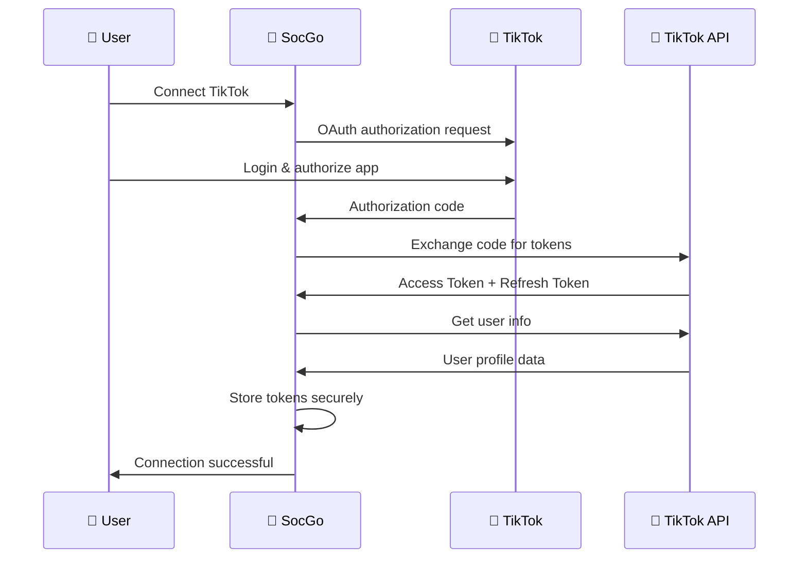
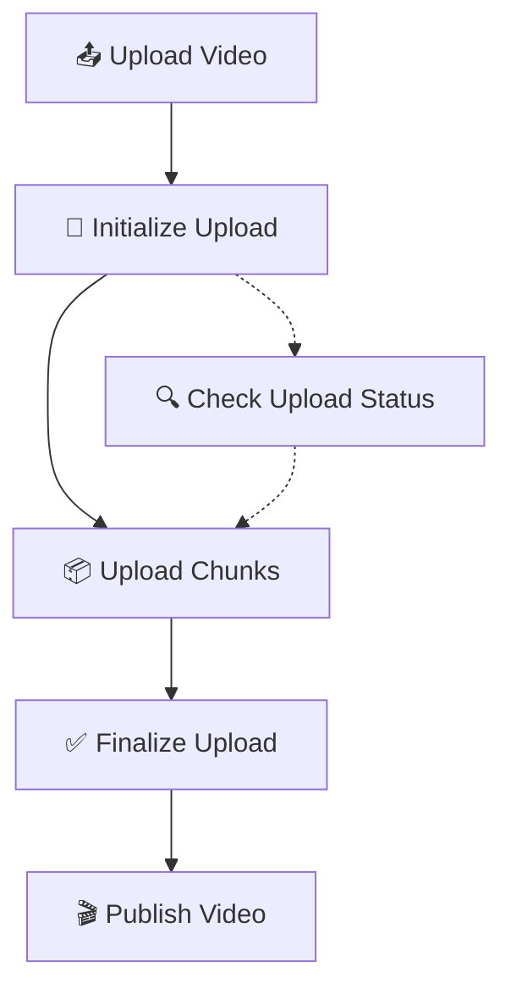

# TikTok Integration

Przewodnik integracji SocGo z TikTok for Business API dla publikowania wideo i zarządzania treściami TikTok.

## 📋 Wymagania

### TikTok for Business
- **TikTok for Business Account**
- **TikTok Developer Account**
- **Business Verification** (dla niektórych funkcji)
- **Uprawnienia**: `video.list`, `video.upload`, `user.info.basic`

### Ograniczenia API
- **Rate Limit**: 50 calls/hour na aplikację
- **Video Requirements**: MP4, MOV, WebM (maksymalnie 500MB)
- **Duration**: 15 sekund - 10 minut
- **Resolution**: Minimum 540x960, maksimum 1080x1920
- **Content Limit**: 2,200 znaków w opisie

## ⚙️ Konfiguracja

### 1. TikTok Developer Console

1. **Utwórz aplikację**:
   ```
   https://developers.tiktok.com/apps/
   ```

2. **Konfiguruj OAuth**:
   - Redirect URI: `http://localhost:8080/oauth/tiktok/callback`
   - Scopes: `video.upload`, `video.list`, `user.info.basic`

3. **Business Verification** (opcjonalne):
   - Wymagane do zaawansowanych funkcji
   - Process może trwać 3-5 dni roboczych

### 2. SocGo Configuration

W `config.yml`:

```yaml
oauth:
  tiktok:
    client_id: "your_tiktok_client_key"
    client_secret: "your_tiktok_client_secret"
    redirect_url: "http://localhost:8080/oauth/tiktok/callback"
    scopes:
      - "user.info.basic"
      - "video.upload"
      - "video.list"
    api_version: "v2"
    
    # TikTok-specific settings
    video_quality: "high"
    max_video_size: 524288000  # 500MB
    supported_formats: ["mp4", "mov", "webm"]
    resolution:
      min_width: 540
      min_height: 960
      max_width: 1080
      max_height: 1920
    duration:
      min: 15    # seconds
      max: 600   # 10 minutes
```

## 🔗 Proces połączenia

### TikTok OAuth Flow



### Token Management

TikTok używa krótkotrwałych tokenów:

```go
type TikTokTokens struct {
    AccessToken     string    `json:"access_token"`
    RefreshToken    string    `json:"refresh_token"`
    ExpiresIn       int       `json:"expires_in"`        // 24 hours
    RefreshExpiresIn int      `json:"refresh_expires_in"` // 365 days
    TokenType       string    `json:"token_type"`
    Scope           string    `json:"scope"`
}
```

## 🎬 Publikowanie wideo

### Video Upload Process

TikTok API ma wieloetapowy proces upload:



### 1. Initialize Upload

```go
// SocGo automatycznie inicjalizuje upload
initResp := tiktok.InitializeUpload({
    VideoSize: videoFileSize,
    ChunkSize: 10485760, // 10MB chunks
    VideoType: "mp4"
})

// Response:
{
  "upload_id": "upload_123456",
  "upload_url": "https://upload.tiktok.com/..."
}
```

### 2. Upload Video Chunks

```go
// Upload w chunks dla dużych plików
for chunkIndex, chunk := range videoChunks {
    uploadChunk(uploadURL, uploadID, chunkIndex, chunk)
}
```

### 3. Publish Video

```go
// Po upload publish z metadata
publishResp := tiktok.PublishVideo({
    VideoID: uploadedVideoID,
    PostInfo: {
        Title: postContent,
        Privacy: "PUBLIC_TO_EVERYONE",
        DisableComment: false,
        DisableDuet: false,
        DisableStitch: false
    }
})
```

### Przykład żądania SocGo

```json
{
  "provider_id": 3,
  "content": "Check out this amazing dance! 💃 #dance #viral #fyp",
  "files": [
    {
      "type": "video",
      "url": "/uploads/dance_video.mp4"
    }
  ],
  "schedule_at": "2024-01-15T20:00:00Z",
  "tiktok_settings": {
    "privacy": "PUBLIC_TO_EVERYONE",
    "allow_comment": true,
    "allow_duet": true,
    "allow_stitch": true
  }
}
```

## 🎥 Obsługa wideo

### Wymagania wideo

```yaml
video_requirements:
  formats: ["mp4", "mov", "webm"]
  max_size: 524288000  # 500MB
  duration:
    min: 15     # seconds
    max: 600    # 10 minutes
  resolution:
    min: "540x960"   # 9:16 portrait minimum
    max: "1080x1920" # 9:16 portrait maximum
    preferred: "1080x1920"
  codecs:
    video: ["H.264", "H.265"]
    audio: ["AAC", "MP3"]
  fps:
    min: 23
    max: 60
    preferred: 30
```

### Automatyczna optymalizacja

```go
func OptimizeTikTokVideo(videoPath string) (string, error) {
    // 1. Sprawdź format i codec
    if !isValidFormat(videoPath) {
        return "", errors.New("unsupported video format")
    }
    
    // 2. Sprawdź duration
    duration := getVideoDuration(videoPath)
    if duration < 15 || duration > 600 {
        return "", errors.New("invalid video duration")
    }
    
    // 3. Sprawdź resolution i aspect ratio
    width, height := getVideoResolution(videoPath)
    if !isValidTikTokResolution(width, height) {
        // Crop/resize to 9:16 aspect ratio
        videoPath = resizeToTikTokRatio(videoPath)
    }
    
    // 4. Compress jeśli za duży
    size := getFileSize(videoPath)
    if size > MaxVideoSize {
        videoPath = compressVideo(videoPath, targetBitrate)
    }
    
    return videoPath, nil
}
```

## 📊 Funkcje zaawansowane

### Video Privacy Settings

```go
type TikTokPrivacy string

const (
    PUBLIC_TO_EVERYONE TikTokPrivacy = "PUBLIC_TO_EVERYONE"
    MUTUAL_FOLLOW_FRIENDS             = "MUTUAL_FOLLOW_FRIENDS"
    FOLLOWER_OF_CREATOR              = "FOLLOWER_OF_CREATOR"
    SELF_ONLY                        = "SELF_ONLY"
)
```

### Content Features Control

```go
type VideoSettings struct {
    Privacy         TikTokPrivacy `json:"privacy_level"`
    AllowComment    bool         `json:"allow_comment"`
    AllowDuet       bool         `json:"allow_duet"`
    AllowStitch     bool         `json:"allow_stitch"`
    BrandContent    bool         `json:"brand_content_toggle"`
    BrandPartner    string       `json:"brand_organic_toggle"`
}
```

### Upload Progress Tracking

```go
type UploadProgress struct {
    UploadID    string  `json:"upload_id"`
    Status      string  `json:"status"`
    Progress    float64 `json:"progress"`
    ChunksTotal int     `json:"chunks_total"`
    ChunksDone  int     `json:"chunks_done"`
}

// Status values: "UPLOADING", "PROCESSING", "READY", "FAILED"
```

## 🔧 Debugging

### Debug Mode

```yaml
debug:
  tiktok: true
  video_processing: true
  upload_progress: true
  chunk_upload: true
```

### Przykładowe logi

```
2024/01/15 20:00:00 [TikTok] Processing video upload
2024/01/15 20:00:01 [TikTok] Video optimized: 45MB → 38MB (1080x1920, 30fps)
2024/01/15 20:00:02 [TikTok] Initializing upload for video: dance.mp4
2024/01/15 20:00:03 [TikTok] Upload ID: 123456789, Chunks: 4
2024/01/15 20:00:04 [TikTok] Uploading chunk 1/4 (25%)
2024/01/15 20:00:08 [TikTok] Uploading chunk 2/4 (50%)
2024/01/15 20:00:12 [TikTok] Uploading chunk 3/4 (75%)
2024/01/15 20:00:16 [TikTok] Uploading chunk 4/4 (100%)
2024/01/15 20:00:17 [TikTok] Finalizing upload...
2024/01/15 20:00:20 [TikTok] Publishing video...
2024/01/15 20:00:25 [TikTok] Published successfully: 7123456789012345678
```

### Upload Status Check

```bash
# Sprawdź status upload
curl -X GET \
  "https://open-api.tiktok.com/v2/post/publish/status/?upload_id=123456" \
  -H "Authorization: Bearer {access_token}"

# Response:
{
  "data": {
    "status": "PROCESSING",
    "upload_id": "123456",
    "fail_reason": ""
  }
}
```

## 🚨 Troubleshooting

### Częste problemy

#### 1. Video Format Not Supported
```
Błąd: "Video format not supported"
Rozwiązanie: Konwertuj do MP4 z H.264 codec
```

#### 2. Video Too Large
```
Błąd: "Video file exceeds maximum size limit"
Rozwiązanie: Skompresuj video lub zmniejsz resolution
```

#### 3. Invalid Video Duration
```
Błąd: "Video duration must be between 15 seconds and 10 minutes"
Rozwiązanie: Przytnij video do odpowiedniej długości
```

#### 4. Upload Timeout
```
Błąd: "Upload timeout"
Możliwe przyczyny:
- Wolne połączenie internetowe
- Duży rozmiar pliku
- Problemy z serwerami TikTok
```

### Video Diagnostyka

```go
func DiagnoseTikTokVideo(videoPath string) error {
    // Użyj ffprobe do analizy video
    cmd := exec.Command("ffprobe", "-v", "quiet", "-print_format", "json", "-show_format", "-show_streams", videoPath)
    output, err := cmd.Output()
    if err != nil {
        return fmt.Errorf("failed to analyze video: %v", err)
    }
    
    var info VideoInfo
    json.Unmarshal(output, &info)
    
    // Sprawdź codec
    if info.VideoStream.Codec != "h264" {
        return errors.New("video must use H.264 codec")
    }
    
    // Sprawdź aspect ratio
    aspectRatio := float64(info.VideoStream.Width) / float64(info.VideoStream.Height)
    if aspectRatio < 0.5 || aspectRatio > 0.6 { // 9:16 ± tolerance
        return fmt.Errorf("invalid aspect ratio: %.2f (should be 9:16)", aspectRatio)
    }
    
    return nil
}
```

## 📈 Monitorowanie

### TikTok-specific Metrics

```yaml
metrics:
  videos_processed: counter
  upload_success_rate: gauge
  upload_duration: histogram
  video_compression_ratio: histogram
  api_response_time: histogram
```

### Rate Limit Monitoring

```go
type TikTokRateLimit struct {
    RateLimitRemaining int `json:"rate_limit_remaining"`
    RateLimitReset     int `json:"rate_limit_reset"`
}

// Headers w odpowiedzi TikTok API:
// X-Rate-Limit-Remaining: 45
// X-Rate-Limit-Reset: 1642781400
```

## 📝 Best Practices

### 1. Video Quality
```go
// Optymalne ustawienia dla TikTok
videoSettings := VideoSettings{
    Resolution:  "1080x1920", // Full HD vertical
    AspectRatio: "9:16",      // Pełny ekran mobile
    FPS:         30,          // Smooth playback
    Bitrate:     "5M",        // High quality
    AudioBitrate: "128k",     // Clear audio
}
```

### 2. Content Strategy
- **Vertical format**: Zawsze 9:16 aspect ratio
- **First 3 seconds**: Najważniejsze dla retention
- **Hashtags**: Używaj trendujących hashtags
- **Music**: Popularne dźwięki zwiększają reach
- **Timing**: Publikuj gdy target audience jest aktywne

### 3. Upload Optimization
```go
func OptimizeUploadStrategy(videoSize int64) UploadStrategy {
    // Dostosuj chunk size do rozmiaru video
    chunkSize := 10 * 1024 * 1024 // 10MB default
    
    if videoSize > 100*1024*1024 { // > 100MB
        chunkSize = 20 * 1024 * 1024 // 20MB chunks
    }
    
    return UploadStrategy{
        ChunkSize:    chunkSize,
        MaxRetries:   3,
        RetryDelay:   time.Second * 5,
        Timeout:      time.Minute * 10,
    }
}
```

### 4. Error Recovery
```go
func UploadVideoWithRetry(video []byte, maxRetries int) error {
    for attempt := 1; attempt <= maxRetries; attempt++ {
        err := uploadVideo(video)
        if err == nil {
            return nil // Success
        }
        
        // Check if retryable error
        if !isRetryableError(err) {
            return err // Permanent failure
        }
        
        // Exponential backoff
        delay := time.Duration(attempt*attempt) * time.Second
        time.Sleep(delay)
    }
    
    return errors.New("max retries exceeded")
}
```

## 🔄 Content Guidelines & Compliance

### TikTok Community Guidelines

```go
func CheckTikTokCompliance(content string, videoPath string) error {
    // 1. Check content policy
    if violatesContentPolicy(content) {
        return errors.New("content violates TikTok community guidelines")
    }
    
    // 2. Check for copyrighted content (future: auto-detection)
    if containsCopyrightedMaterial(videoPath) {
        return errors.New("video may contain copyrighted material")
    }
    
    // 3. Check for prohibited hashtags
    if containsProhibitedHashtags(content) {
        return errors.New("content contains prohibited hashtags")
    }
    
    return nil
}
```

### Regular Health Checks

```go
func TikTokHealthCheck() error {
    // 1. Test token validity
    if err := validateAccessToken(); err != nil {
        return fmt.Errorf("token validation failed: %v", err)
    }
    
    // 2. Test upload capability
    if err := testVideoUpload(); err != nil {
        return fmt.Errorf("upload test failed: %v", err)
    }
    
    // 3. Check API rate limits
    if err := checkRateLimits(); err != nil {
        return fmt.Errorf("rate limit check failed: %v", err)
    }
    
    return nil
}
```

### API Updates & Migration

TikTok regularnie aktualizuje API:

```yaml
api_versions:
  current: "v2"
  deprecated: ["v1"]
  
migration_timeline:
  v1_sunset: "2024-06-01"
  v2_mandatory: "2024-03-01"
  
new_features:
  v2:
    - "Enhanced video upload"
    - "Better error handling"
    - "Improved rate limiting"
```